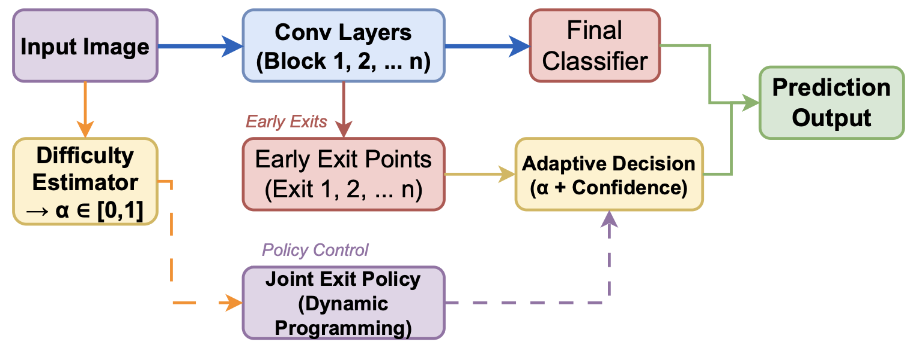

<p align="center">
  
  
  
  
</p>

<h1 align="center">DART: Dynamic Adaptive Real-time Thresholding for Early-Exit DNNs</h1>

<p align="center">
  <strong>Input-Difficulty-Aware Adaptive Threshold Mechanism for Efficient Deep Neural Network Inference</strong>
</p>

## Overview

**DART** introduces a novel approach to early-exit deep neural networks by dynamically adjusting confidence thresholds based on input difficulty. Unlike traditional static threshold methods, DART computes a **difficulty score (alpha)** for each input sample and uses reinforcement learning to optimize exit decisions.

---

## Architecture

<p align="center">
  
</p>

---

## Results

### Accuracy vs. Computational Savings (CIFAR-10)

| Method | Accuracy | FLOPs Reduction | Throughput Gain |
|--------|----------|-----------------|-----------------|
| Baseline (No EE) | 91.2% | 0% | 1.0x |
| Static Threshold | 89.8% | 35% | 1.4x |
| BranchyNet | 90.1% | 32% | 1.3x |
| **DART (Ours)** | **90.9%** | **45%** | **1.7x** |

### Exit Distribution by Difficulty

| Difficulty (alpha) | Exit 1-2 | Exit 3-4 | Exit 5-6 |
|--------------------|----------|----------|----------|
| Easy (< 0.3) | 65% | 25% | 10% |
| Medium (0.3 - 0.7) | 20% | 55% | 25% |
| Hard (> 0.7) | 5% | 20% | 75% |

---

## Quick Start

```bash
# Clone and install
git clone https://github.com/parth-patne/DART.git
cd DART
pip install -r requirements.txt

# Run experiments
python dynamic-alexnet-early-exit.py
```

---

## License

This project is licensed under the **MIT License** - see the [LICENSE](LICENSE) file for details.
